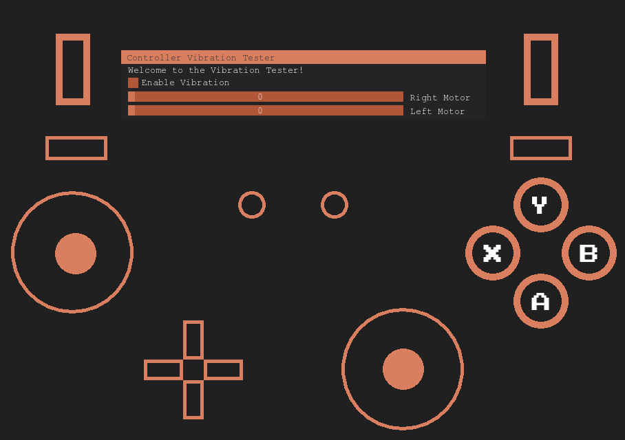

# Controller-Tester SFML
A Simple Controller Tester using SFML and XINPUT in C++ With Vibration

Also check out my GUI Framework that was used in this project, https://github.com/clearlyyy/sfml-gui
